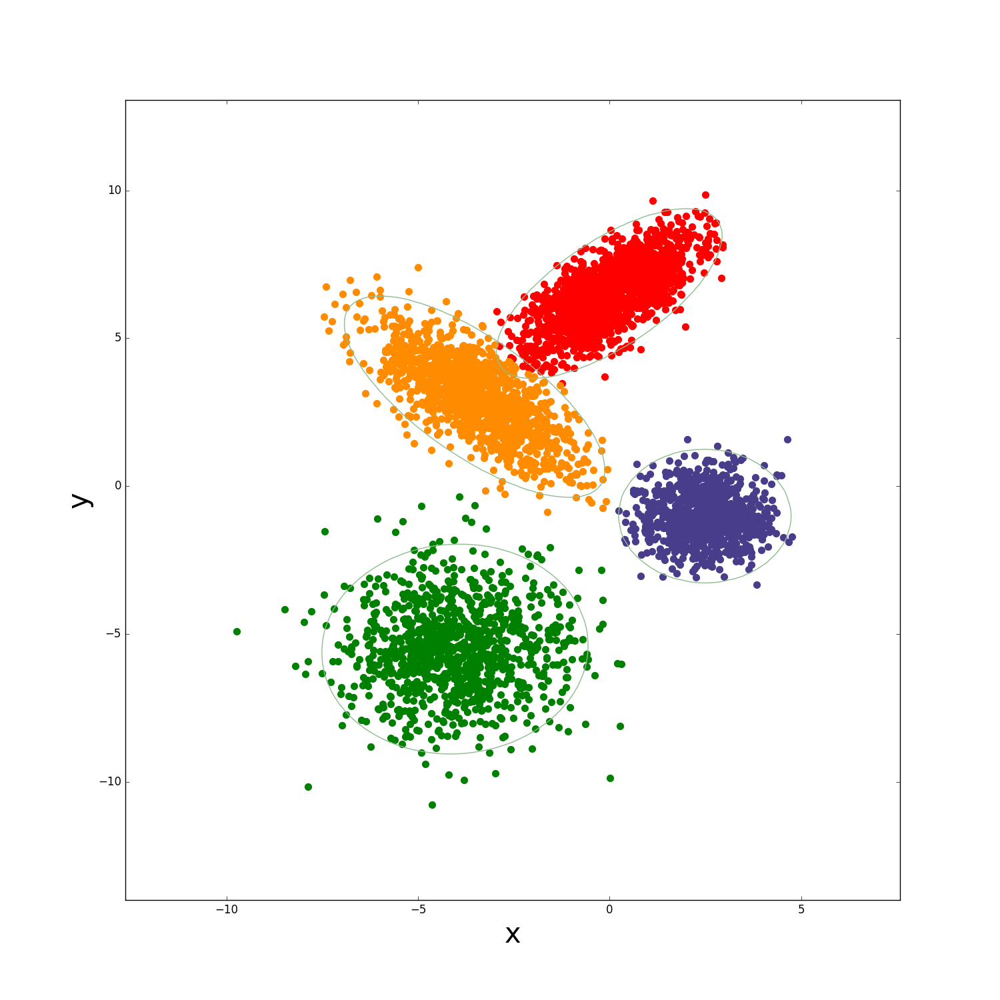

# VB学习器

## 功能

该代码是本人自己写的基于混合高斯模型的VB算法学习器，聚类效果图如下：<br>


## 用法

vbem.py文件写的是传统的VB算法，用法：

```python
from vbem import *
cluster = VBEM().train(data, alpha0, beta0, nu0, W0, mu0, K)
```

stochastic_vb.py文件写的是随机VB算法，用法：
```python
from stochastic_vb import *
cluster = SVB().train(data, alpha0, beta0, nu0, W0, mu0, K, tau, d0)
```

dvb.py文件写的是分布式网络下的VB算法，数据文件分为多个子集文件，输入，用法：
```python
from db import *
for i in range(numprocess):
        p = DVBEM(data[i], alpha0, beta0, nu0, W0, mu0, K, A, i, mu_p, sd, sv, sem, N)
        p.start()
        ps.append(p)
        
    for p in ps:
        p.join()
```

参数的具体含义可以参考variational_Bayesian_method.md。

